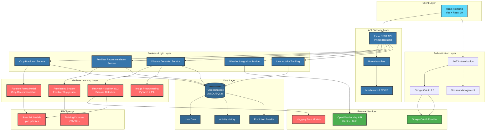
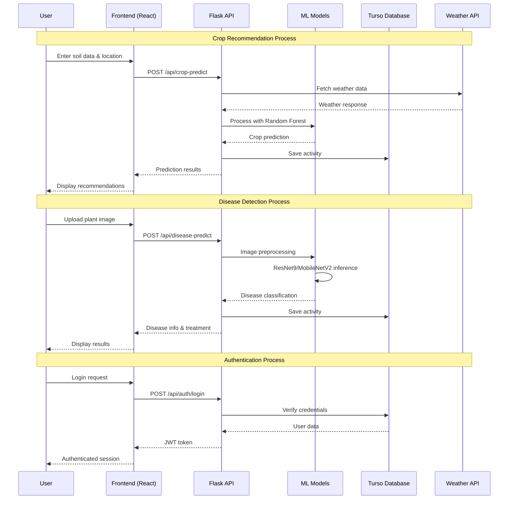

# 🌾 Smart Agriculture System using Machine Learning & IoT

## 📊 Data Sources

- [Crop Recommendation Dataset](https://www.kaggle.com/atharvaingle/crop-recommendation-dataset) – This dataset contains 2200+ samples with 7 key features—Nitrogen, Phosphorus, Potassium ratios, temperature (°C), humidity (%), soil pH, and rainfall (mm)—to predict the most suitable crop for optimal yield and resource management in Indian agricultural conditions.
- [Fertilizer Suggestion Dataset](https://github.com/Gladiator07/Harvestify/blob/master/Data-processed/fertilizer.csv) – This dataset contains nutrient requirements (N, P, K), soil pH, and soil moisture levels for 23 crops, enabling precise fertilizer recommendations tailored to specific crop-soil conditions.
- [Plant Disease Detection Dataset](https://www.kaggle.com/vipoooool/new-plant-diseases-dataset) – The New Plant Diseases Dataset contains approximately 87,900 RGB images of healthy and diseased crop leaves, categorized into 38 classes, with an 80/20 train-validation split for robust plant disease classification.
- [Plant Disease Identification Model](https://huggingface.co/linkanjarad/mobilenet_v2_1.0_224-plant-disease-identification) - A pre-trained MobileNetV2 model hosted on Hugging Face, fine-tuned on the Kaggle Plant Diseases Dataset. Supports identification of 38 different plant diseases across various crop species.

## 🌱 Overview

Agriculture plays a vital role in economic development, especially in countries like India, where a large portion of the population depends on farming for livelihood. Leveraging **Machine Learning**, **Deep Learning**, and **IoT**, this project aims to assist farmers in making data-driven decisions.

This web-based platform includes three key applications:

- 🌾 Crop Recommendation
- 💊 Fertilizer Suggestion
- 🦠 Plant Disease Detection

## 🚀 Applications

### 🌾 Crop Recommendation System

- **Input**: Soil N-P-K values, State, and City
- **Output**: Suggests the most suitable crop based on soil nutrients and local weather data.
- **Note**:  
  - Enter N-P-K values as a ratio.  
  - Use well-known city names to ensure compatibility with the weather API.

### 💊 Fertilizer Suggestion System

- **Input**: Soil nutrient values and selected crop
- **Output**: Recommends necessary fertilizers by identifying nutrient deficiencies or excesses in the soil.

### 🦠 Plant Disease Detection System

- **Input**: Image of a plant leaf
- **Output**:
  - Identifies if the plant is healthy or diseased  
  - If diseased, provides:
    - Disease name  
    - Background information  
    - Treatment and prevention suggestions

> ⚠️ Currently supports a limited number of crops.

## 🛠️ Tech Stack

### Frontend

- **Framework**: React 19 with Vite
- **Styling**: CSS3 with custom variables and responsive design
- **UI Components**: Lucide React for icons
- **3D Graphics**: Three.js for interactive landing page animations
- **Routing**: React Router DOM v7
- **State Management**: React Context API
- **Build Tool**: Vite with React plugin
- **Package Manager**: npm

### Backend

- **Framework**: Flask (Python)
- **ML/DL Libraries**:
  - PyTorch for deep learning models
  - Scikit-learn for traditional ML algorithms
  - Pandas & NumPy for data processing
  - Pillow (PIL) for image processing
- **Authentication**:
  - JWT (JSON Web Tokens)
  - Google OAuth 2.0 integration
  - Bcrypt for password hashing
- **APIs**:
  - OpenWeatherMap API for weather data
  - Custom REST APIs for predictions
- **Model Serving**: Custom PyTorch model inference

### Database

- **Primary**: Turso (LibSQL) - Edge database for production
- **Local Development**: SQLite3
- **ORM**: Custom SQL queries with libsql-client

### Machine Learning Models

- **Crop Recommendation**: Random Forest Classifier
- **Fertilizer Suggestion**: Rule-based recommendation system
- **Disease Detection**: ResNet9 (Custom CNN) + MobileNetV2 (Hugging Face)

### Deployment & DevOps

- **Frontend Hosting**: Vercel
- **Backend Hosting**: Render
- **Database**: Turso (Edge SQLite)

### External Services

- **Weather Data**: OpenWeatherMap API
- **Authentication**: Google OAuth
- **Image Processing**: Server-side with PyTorch/PIL

## 💻 How to Use

- **Crop Recommendation**  
  ➤ Enter N-P-K ratios along with your state and city. The system uses weather data to recommend the best crop.

- **Fertilizer Suggestion**  
  ➤ Provide the current nutrient levels of the soil and the crop you plan to grow. Get fertilizer suggestions to balance the soil.

- **Disease Detection**  
  ➤ Upload a clear image of the plant leaf. The system will detect the disease (if any) and provide relevant info and solutions.

## System Architecture



### Data Flow Architecture



## ❓ How to Run Project

### For backend

1. **Create and Activate Virtual Environment**

   **For Mac/Linux:**

   ```bash
   # Create virtual environment
   python3 -m venv venv

   # Activate virtual environment
   source venv/bin/activate
   ```

   **For Windows:**

   ```bash
   # Create virtual environment
   python -m venv venv

   # Activate virtual environment
   venv\Scripts\activate
   ```

2. **Install Required Dependencies**

   ```bash
   cd backend
   # Install all required packages
   pip install -r requirements.txt
   ```

3. **Set up Environment Variables** (optional)

   ```bash
   # For Mac/Linux
   export FLASK_APP=app.py
   export FLASK_ENV=development

   # For Windows
   set FLASK_APP=app.py
   set FLASK_ENV=development
   ```

4. **Run the Flask Application**

   ```bash
   # Start the Flask server
   flask run
   ```

   or (below recommended for development purposes)

   ```bash
   # run the below code inside backend directory
   python app.py
   ```

   The application will be available at `http://127.0.0.1:8000/`

>**Note:**
>
>- Make sure you have Python 3.9.6 installed on your system
>- To deactivate the virtual environment when done, simply type:
>
  > ```bash
  >  deactivate
  > ```

## 🤝 Contribution

Special thanks to **[Soumalya](https://github.com/soumalyasmp)** for their invaluable contributions to the frontend

Feel free to fork this repository and contribute by:

- Adding support for more crops
- Improving model accuracy
- Enhancing UI/UX

## 📬 Contact

For queries or suggestions, feel free to open an issue or reach out!

## 💳 License

This software is released under the [GNU AGPL-3.0](https://github.com/AnishSarkar22/Farmalyze/blob/main/LICENSE) License.
